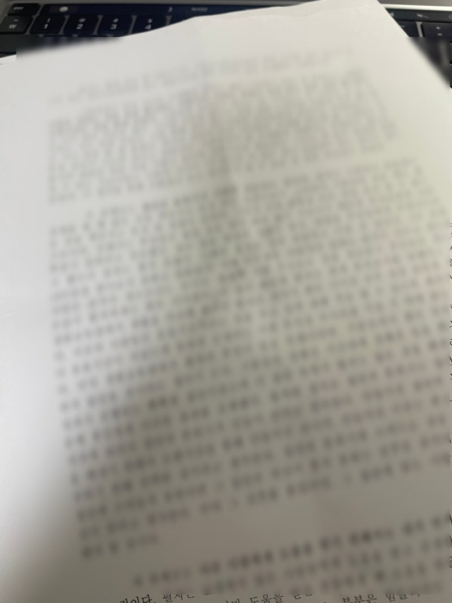
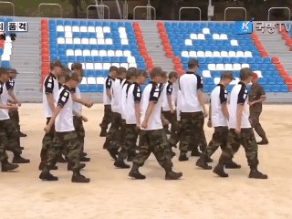
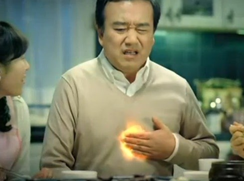
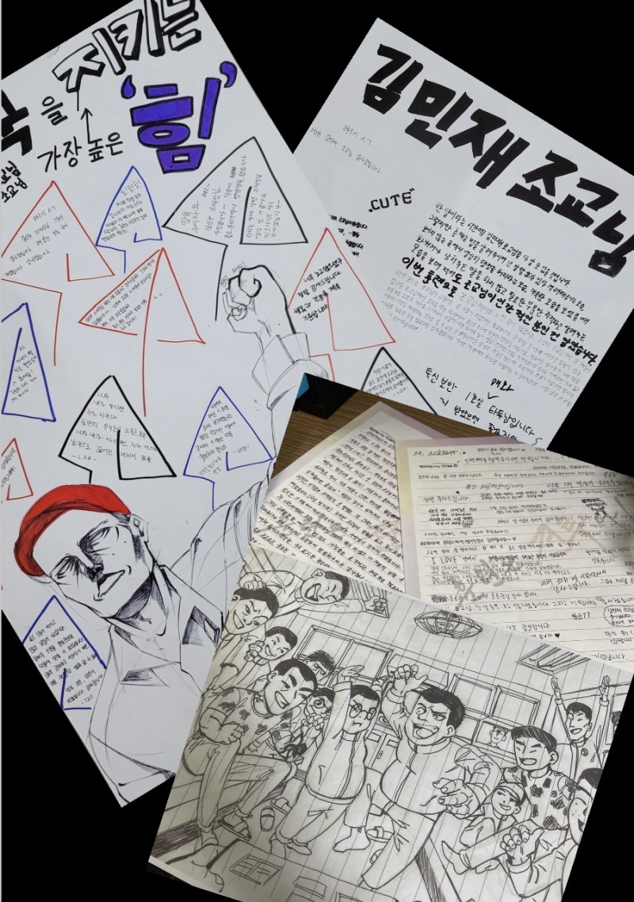
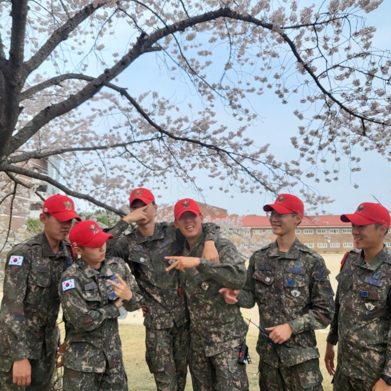

반갑습니다!

블로그를 쓰며 첫인사 한번 올려봅니다.

​

글을 시작하기 전 필자는 글쓰기에 대해 전문적으로 배워본 적도 없으며,

글을 잘 쓴다고 생각하지 않는다. 이 점 참고하여 글을 읽어주길 바란다.

---

사실 필자는 블로그를 시작하기 전 군대에서부터 글을 쓰기 시작했다.

글을 썼던 이유는 내 생각을 정리하는 시간이 필요하다고 느꼈기 때문이다.

​

필자는 MBTI 극 N으로 상상과 생각을 정말 많이 한다.

​

쓸데없는 생각부터 인생에 살면서 필요한 생각까지 한다.

이러한 생각을 정리하는 시간이 없다면 망상만 하는 미친놈이 되기 때문에,

필자는 필자의 생각을 정리하고 다시 한번 생각해 보는 시간을 가진다.

​

​

필자의 생각을 처음으로 정리한 시기는 군대였다.

필자가 군 생활을 하며 직접 썼던 글

​

군대에서 썼던 글도 기회가 된다면 블로그에 정리해 보겠다.

​

​

그리하여 오늘은 필자가 처음으로 글을 쓴 이유가 있었던 공간,

필자가 많이 변화할 수 있었던 시간을 제공한 필자의 군대 생활에 대해 이야기해볼까 한다.

---

필자의 군대 생활은 말 그대로 스펙터클했다.

필자는 대한민국 공군 병 838기로 2022년 5월 30일부터 2024년 3월 5일까지

군 생활을 했다.

​

4계절 동안 기본군사훈련단 신병 2대대 훈육 조교로 일했으며,

나머지 4계절 동안은 파견으로 생환 교육대 생환 조교로 근무했다.

​

8계절의 이야기를 오늘의 글에 담기에는 무리가 있으니

오늘은 필자가 기억에 남은 군대 에피소드에 대해 써보려 한다.

(필자의 모든 군 생활을 말하기 위해서는 초록병의 이슬이 필요하다,,,,, )

​

---

필자가 훈련단에서 훈육 조교를 하던 시절

처음으로 빨간 모자를 쓰고 조교로 투입되었던 차수에 일어난 일이다.

​

​

각 소대 소대 교육 중 제식 교육을 하는 시간이었다.

제식 교육을 하며 바른 걸음에 대해 소대 훈련병들에게 알려주는 시간을 가지고 있었는데,

한 훈련병이 계속 알려주어도 발과 손이 같이 나가는 것이었다.

​

훈련병들의 어리버리 제식

​

그리하여 필자는 걸음걸이를 못하는 훈련병에게

1시간 동안 밀착 훈육을 통해 바른 걸음에 대해 알려주었다.

(1시간 동안 알려줘도 손과 발이 같이 나갔다.)

​

​

군필자들은 알 것이다. 사회에서 평생 편하게 걸아 다니다가

손 각도 45도, 팔꿈치를 쫙 펴며, 옆 동기들과 발을 맞추어 걷는다는 것은 어려운 일이다.

(실제로 어리버리까는 훈련병들이 매 차수 있다.)

​

​

제식 교육이 끝나고 필자는 일병 짬지 시절이어서

점심을 5분 만에 먹고 훈련병들의 퇴식 포인트에 바로 달려갔다.

​

​

포인트에서 관장을 하던 도중

제식 시간에 1시간 동안 밀착 훈육을 당했던 훈련병이

당당하게 손과 발이 같이 나가는 어리버리 걸음걸이를 하며 내 앞을 지나가던 것이었다.

​

​

필자는 그 훈련병을 바로 불러 세웠고,

다시 한번 밀착 훈육에 들어갔다.

​

​

그 자리에서 또 한 번 30분 동안 바른 걸음에 대해 알려주었고,

어리버리 훈련병은 바른 걸음을 해내지 못했다.

필자는 답답해서 미칠 지경이었다.

​

​

​

그러다가 훈련병이 필자 앞에서 서럽게 울었다.

우는 이유를 정리하자면 이거였다.

​

​

"자신은 22년 동안 팔자걸음에 팔을 흐느적대며 걸었는데,

갑자기 걸음걸이를 바꾸는 것이 너무 힘들다. 잘하고 싶은 마음은 너무 큰데 마음처럼 내 몸이 되지 않는다."

​

​

이러한 말을 하며 필자 앞에서 펑펑 울었다.

(내 소대 훈련병이 아니었다면 울었을 때 뭘 잘했다고 우냐며 꾸짖었겠지만

우는 훈련병이 내 소대 훈련병이라 일단 달래주었다. )

​

​

그리하여 필자는 훈련병에게 말했다.

"너가 잘하고 싶어 하는 마음 나도 알고 그 마음 멋있다. 너가 아예 안 하려는 훈련병보다 훨씬 낫다.

근데 너 수료식 때 부모님이 오셔서 보실 건데 그때도 손과 발이 같이 나가며 걸을 거냐? 그건 안타까운 일이다.

소대로 복귀해서 열심히 연습하고 나한테 변화한 모습을 보여줘라"

​

​

이 말을 들은 훈련병의 눈에는 독기가 가득 차 보였다.

사실은 이때까지만 하더라도 그 훈련병이 그렇게까지 변화할 줄 상상도 못했었다.

​

​

항상 소대에 들어가면 그 훈련병은 바른 걸음을 혼자 연습하고 있었고,

점점 바른 걸음의 정석에 가까워지기 시작했다.

​

​

대망의 수료식이 다가오고 수료식을 할 때

그 훈련병은 마침내 바른 걸음을 했고, 무사히 수료할 수 있었다.

​

​

그 후

아무 생각 없이 인트라넷(군대에서 사용하는 메일 체계)에 들어갔는데,

낯익은 이름이 보낸 메일이 하나가 와있었다.

​

​

어리버리 훈련병이 내 메일로 편지를 보낸 것이었다.

내용은 이러했다.

​

​

사실 그 훈련병은 적응을 하지 못해 3번이나 입대했다가

모두 귀가 조치를 받고 집에 돌아갔었고,

나를 소대 조교로 만났을 때가 마지막으로 해보는 군대 지원이었다.

여기서도 적응하지 못하면 군대를 포기해야겠다고 생각했던 것이다.

마지막이라 생각하고 공군에 왔는데, 필자를 소대 조교로 만난 것이었고,

항상 만날 때마다 "잘하고 있어"라는 말 한마디가 포기하지 않고 할 수 있게 만들어 줬으며

인생에서 처음으로 나 자신이 해냈다는 감정을 느끼게 해주어

고마웠다는 편지의 내용이었다.

​

​

그 편지를 읽은 필자는 1시간 동안 생각에 잠겼다.

"필자라는 사람이 다른 사람의 인생을 변화시킬 수 있는 사람이구나"라는 생각이 들었기 때문이었다.

​

​

그리하여 이 에피소드를 계기로

빨간 모자를 쓰고 훈련병들에게 해주는 말은

훈련병들이 느낄 때 결코 가볍지 않구나라는 것을 뼈저리게 느꼈다.

​

​

또한 필자라는 사람이 다른 이의 인생을 변화시킬 수 있는

중요한 사람이라는 것을 느꼈다.

​

​

이 일을 계기로 훈련단에 있을 때

마지막까지 담당했던 소대원들에게 많은 말들을 해주었다.

소대 훈련병들이 직접 써준 롤링페이퍼

​

결과적으로 본다면 소대 훈련병들이 필자가 해준 말들이

도움이 되고 힘이 되었던 것 같다.

​

​

군대에서의 생활은 필자의 인생에

거름, 그것도 배변 냄새가 지독하게 나는 거름을 뿌려주었지만

그 거름을 토대로 현재 앞으로 나아가는 걸음을 하고 있지 않나 싶다.

​

​

군대에 대해 더 많은 말들을 하고 싶지만,

블로그의 취지상 과거의 생각이 아닌 현재, 미래의 생각에 대해

쓰려고 하기 때문에 과거의 이야기인 군대 에피소드는 여기서 마무리하겠다.

---

끝으로 필자가 군대 생활을 하며 다시 한번 재미있게 본 드라마가 있는데,

"슬기로운 의사 생활"이다.

​

​

그 드라마를 보며,

왜 드라마 제목이 "슬기로운"이라는 문구가 붙었을까에 대해 생각해 보았다.

​

​

사실 사회에서 생활을 하다 보면 슬기롭다는 표현은

거의 사용하지 않는다.

​

​

이러한 이유는 슬기롭다를 남에게 설명하려 했을 때,

다른 표현으로 완벽하게 설명하지 못하기 때문이라고 생각한다.

​

​

슬기롭다는 것에는 정답이 없는 것이었다.

​

​

​

​

그러나 필자는 이제 슬기로움이 대충 무엇인지 알 것 같다.

​

​

​

왜냐면 필자의 군 생활이

정말 슬기로웠기 때문이다.

​

​

Today Song : September - Earth, Wind & Fine

​

​