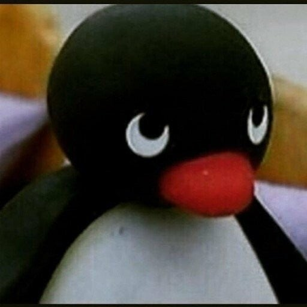
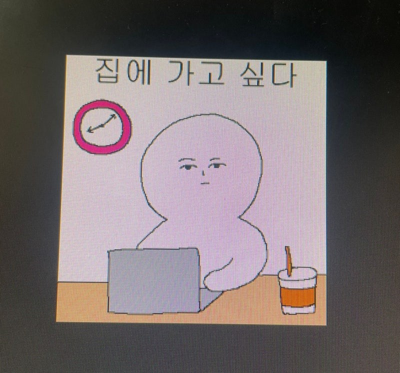
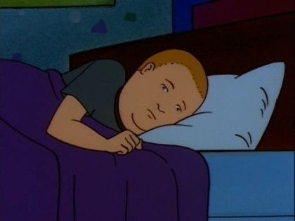
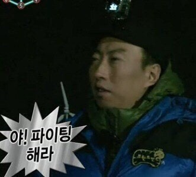
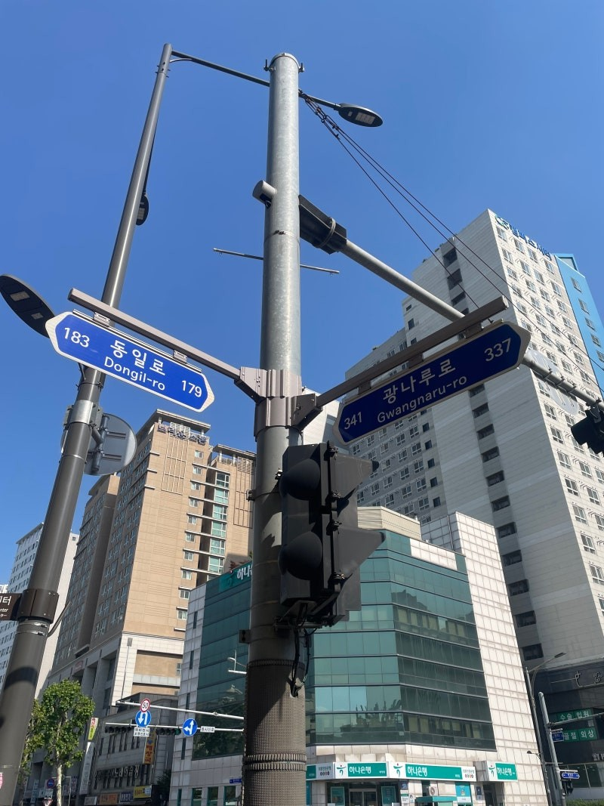

한 달 만에 돌아온 필자의 글이다.

오랜만에 돌아온 것에 미안함을 느낀 필자

​

시간이 정말 빠르게 지나는 것 같다.

벌써 1년의 절반인 6월이 다가온 것은 정말 놀랍다,,,,,

​

---

​

3월부터 5월까지 정신없이 학교 수업과

과제만 하다 보니 시간이 정말 빠르게 지나는 것 같다.

필자의 학교 실습실 컴퓨터에 있던 짤

학교에만 있으면 극 E인 필자도 I가 되어

집에 가고 싶다고 생각을 수십 번 하는 것 같다.

​

이 생각은 필자만 하는 것이 아닌

사회생활하는 모든 분들이 하는 생각이지 않나 싶다.

(모두 다 힘을 내시길,,,,)

---

오늘 말하고 싶은 주제는

인생의 "목표"이다.

​

​

전역을 하고 필자는 사회에 나오면

하고 싶은 것, 그리고 이루고 싶은 것들이 정말 많았다.

​

미필일 때는 항상 먼 미래의 목표보다는

가까운 현재의 목표가 먼 미래의 목표를 만든다고 생각했다.

​

그러나 지나고 보니 막상 바로 앞의 목표보다

미래의 목표가 더 중요하다는 걸 깨달았다.

​

오늘은 그 깨달음을 얻은 서사를

글로 써볼까 한다.

​

---

필자는 군대 시절에 휴가를 원기옥하여

말년에 2개월 반 정도 15일씩 군대와 사회를 왔다 갔다 하며 보냈다.

(2년간 고생한 군 생활에 보답받는 느낌이 들었다)

​

휴가를 보내던 중

가족 사정으로 서울에서 병간호를 하기 위해 서울에서 머물 때였다.

​

오랜만에 정말 친한 고등학교 친구에게 연락했고,

그 친구의 답변은

"많이 바빠서 만날 수는 있는데 잠깐 만날 수 있다."였다.

​

그리하여 필자는 친구를 만나러

서울대입구역으로 향했다.

​

친구를 만나서 이런저런 이야기를 했다.

그러나 정말 신기하게도 말로는 설명할 수 없는

벽이 느껴졌다.

​

필자가 군대에 있을 때

필자의 친구는 사회에서 자신만의 공동체 사회를 만들고 이끌며,

많은 것을 이뤘던 것이었다.

​

​

왜 벽이 느껴졌었는지

필자는 그날 저녁 침대에 누워 고민했다.

​

​

​

​

고민한 필자 생각의 답은 이것이었다.

​

같은 교복을 입고 같은 공동체에 있었을 때는

서로 같은 목표를 가지고 서로를 다독였다면,

​

지금은 서로 다른 공동체에 존재하며

서로 다른 목표를 가지고 있었기 때문이라 생각했다.

​

필자의 친구는 미래에 대한 목표가 확고했던 것이었다.

​

그 목표에 대해 세부적인 목표를 만들고 하나씩 이루어 내고 있었다.

​

​

​

그 후 전역을 하고, 복학 후 학교에 다니고 있을 때

오랜만에 과 동기를 만났을 때의 일이다.

​

필자의 과 동기는

대학교를 졸업하고 과 교수님과 컨택이 되어

대학원에 진학을 했다.

​

오랜만에 술자리에서 만나 이런저런 이야기를 하고,

기회가 되어 필자의 동기가

일하는 장소에 갈 수 있었다.

​

그곳에서 필자의 동기가 일하는 모습을 보았다.

필자의 든 생각을 말하자면

동기의 일하는 모습은 정말 치열해 보였고, 멋있었다.

​

​

목표를 가지고 치열하게 살고 있다는 것이

보였기 때문이다.

​

필자의 고등 동창, 대학 동기의 목표에 대해 진심으로 응원한다.

​

---

필자의 친구들의 목표와 사회 모습을 보고

필자는 많은 생각이 들었다.

​

**"그럼 나는 무엇을 하며 살아야 하나?"**

​

이 생각이 24년 1분기의 큰 난제였다.

대학을 다녀도 미래의 큰 목표가 보이지 않았고,

당장 무슨 일을 하며 살아야 할지 막막했다.

​

하고 싶고 이루고 싶은 것이 있어도

방법을 몰라 하지 못했고,

막상 하려고 해도 생각처럼 되지 않았다.

​

이러한 시행착오로 3개월 정도를 보냈다.

​

​

​

그러다가 우연히 한 유튜브를 보게 되었다.

그 유튜브 채널의 내용은 이러했다.

​

유튜브 채널의 주인은 20대 초반에

성공이 목표였고, 30대가 되어

슈퍼카와 한강이 보이는 집 그리고 초호화 요트를 샀다.

​

그리하여 자신이 20대 초반에

대학에 다니면서 성공을 위해 들었던 자신의 생각을

일기에 적고 정리하였고, 성공 후 일기의 내용을 유튜브로 만들어 올린 것이다.

​

유튜브의 주인은 큰 꿈을 가지고 살았으며

큰 꿈을 이루기 위해 목표를 하나씩 설정하며 이뤄냈다.

​

신기하게도 필자가 들었던 생각과 많은 공통점이 존재했다.

​

유튜브를 보며 든 생각은

필자와 똑같은 생각을 한 사람이 성공을 했고, 목표를 이뤄냈다는 것에

사회에 던져질 용기를 가질 수 있었다.

​

그러나 필자는 두루뭉술한 목표보다

정말 하고 싶고 원하는 목표를 잡고 싶었다.

​

​

이 목표는 최근 사건을 계기로 만들어졌다.

​

최근 학교에서 우수 연구자 기술교류회라는 것을 진행했다.

학과 교수님께서 외국 대학에서 교수 생활을 하고 계신 한국인 의공학과 교수님들을

초청하여 교수님들의 연구성과를 서로 설명하며 지식을 공유하는 자리였다.

​

많은 교수님들이 오셔서 자신의 연구성과를 설명하고

질의응답을 하며 서로의 의견과 정보를 공유하는 모습을

필자는 멀리 앉아서 구경했다.

​

​

그 후 연구회가 끝나고 많은 필자의 학교 교수님들이

외국 대학의 한국인 교수님들과 이야기하기 위해 자신의 명함을 들고

차례가 오기를 문 앞에서 기다리고 있었다.

​

필자는 그 자리에서 한 분야의 최고 자리에 오른 사람을 본 것이며,

교수 중에 최고의 교수를 본 것이었다.

​

옛날부터 필자의 꿈은

한 분야의 최고가 되는 것이 꿈이었다.

​

그러한 필자의 꿈을 직접 이룬 사람을 보니

필자의 가슴은 두근거렸다.

​

"세상의 새로운 발견을 해내고 발전을 이끄는 위치에 있는 사람들이라니,,,,"

​

필자가 의공학과를 선택한 이유 중에 하나는

많은 사람들에게 의공학을 통해 영향력 있는 사람이 되고 싶어서였다.

​

이러한 꿈만 있었는데

직접 필자의 꿈을 이룬 사람을 보니 필자도 해내야겠다는 다짐이 생겼다.

​

다짐에 대한 목표를 다시 설정했고,

미래의 큰 꿈과 목표에 대해 다시 설정했다.

​

다시 한번 내 시간을 내 목표와 꿈을 위해 사용하기 시작한 것이다.

​

---

​

​

인생에서 무엇이든지 선택의 갈림길이 존재한다고 생각한다.

그리고 선택을 하고많은 사람들이 그 선택에 후회를 한다.

​

​

그러나 준비가 되어있다면

어떤 선택을 하더라도, 그 선택을 최고의 선택으로 만들 수 있다고 생각한다.

​

​

필자의 인생에 5가지 갈림길이 나와도

그 5가지의 길이 왕복 8차선의 길이 되는 그날까지

항상 생각하고 노력하겠다.

​

​

​

​

Today Song : Build Me Up Buttercup - The Foundations

​

​

​

​