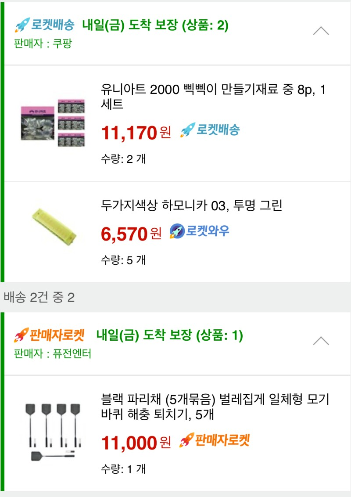
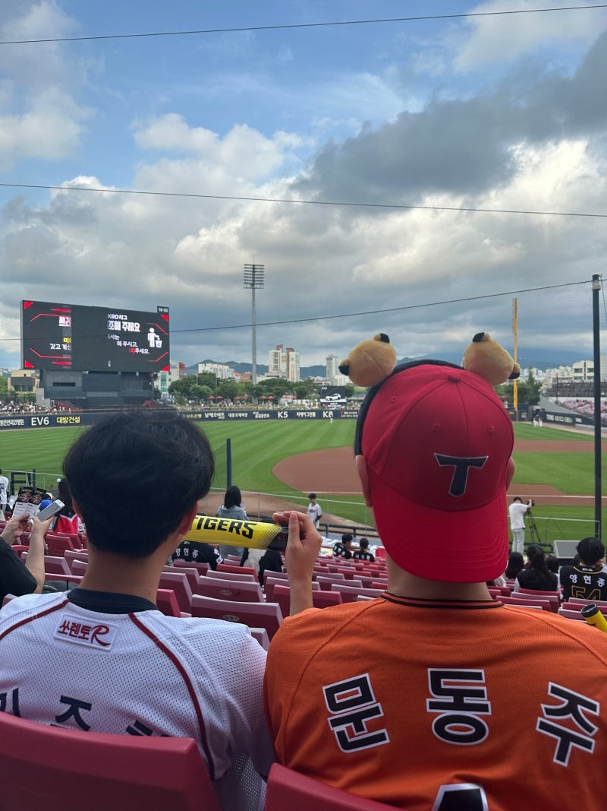
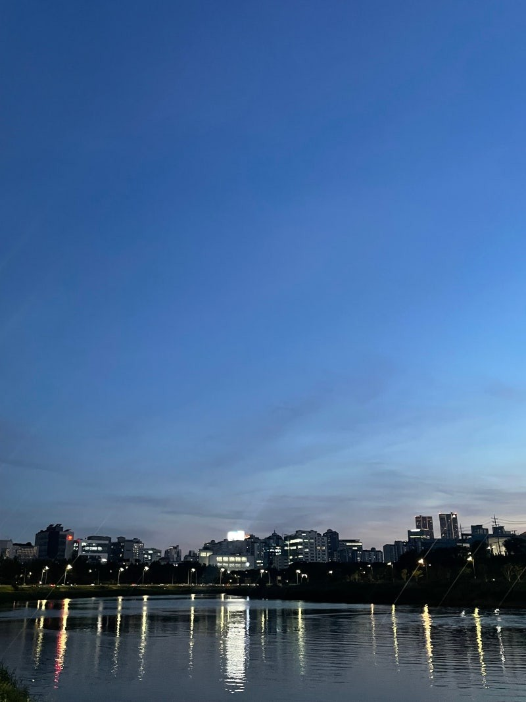

잊을만하면 돌아오는 필자의 글이다.

​

벌써 2024년의 절반이 지난 7월이 다가왔다.

2024년은 다른 해와는 다르게 정말 빨리 지나가는 느낌이 든다.

​

​

현재 필자는 학교를 종강하고

백수의 삶을 살고 있다. (현재는 일을 구함)

​

​

방학이 된 기념으로 오랜만에

고향 친구들과 강진으로 여행을 갔다.

​

​

​

원래도 모이면 재미있게 놀지만

필자는 이번 여행을 조금 더 재미있게 보내고 싶었다.

​

​

그리하여 준비한 것

​

​

​

바로 하모니카 좀비 놀이이다.

​

​

​

​

(ㅋㅋㅋㅋㅋㅋㅋㅋㅋㅋㅋㅋㅋㅋㅋㅋㅋㅋㅋㅋㅋㅋㅋㅋ)

​

이것이 나이 23 대한민국 군필 남자들이

여행 가면 하는 행동이다.

​

​

​

그 후 여행에 다녀온 뒤

​

오랜만에 광주에서 야구를 직관했다.

​

​

종강 후 오랜만에 가본 내 고향 광주였다.

항상 느끼지만 광주송정역에 도착하여 내리면

정겨운 무엇인가가 나를 감싸주는 것 같다.

​

​

그리하여 오늘 이야기할 주제는

나의 고향 광주와 현재 살고 있는 서울에서의 경험, 그리고

**필자의 인생에서 경험이 중요한 이유**

를 주제로 글을 써보려 한다.

​

---

고1 여름방학 필자는 아버지의 권유로

외삼촌 출장에 따라가게 되었다.

출장 장소는 미국의 뉴욕이었다.

​

​

뉴욕에 도착한 필자는 새로운 환경이 정말 신기했다.

​

​

​

뉴욕의 환경을 보고 놀란 필자

​

​

왜냐하면 그 시절 필자는 마블의 극성팬이었다.

뉴욕의 길을 걸으면 영화에서 나온 건물과 거리가

필자의 눈에 영화 스크린처럼 들어왔기 때문이었다.

​

​

여행을 간 것이 아닌 외삼촌을 따라 출장을 간 것으로

투어는 많이 하지 못했지만

​

​

필자의 눈에 들어온 한 가지가 있었다.

​

​

바로 에어팟을 끼고 길거리를 돌아다니는

뉴욕 현지인들이었다.

​

​

한국인들과 극히 똑같지만 다른 한 가지

바로 에어팟

​

​

에어파

​

그 시절 에어팟은 20만 원으로 비싼 가격을 형성하고 있었고,

줄 이어폰을 자르면 똑같다는 조롱을 한국에서 받고 있었다.

​

​

그러한 에어팟을 뉴욕 사람들은

거의 사용하고 있던 것이었다.

​

​

필자는 정말 신기했다.

"저 줄 없는 게 정말 편해서 사용하고 다니는 건가?"

​

​

그리하여 한국에 귀국한 후

필자는 에어팟을 구매하여 사용하고 다녔다.

​

​

필자가 에어팟을 사용하는 모습을 본

필자의 친구들은 하나같이 반응이 똑같았다.

"저걸 돈 주고 산다고?"

​

​

필자의 친구들이

필자의 에어팟에 대해 험담을 했지만

에어팟은 정말 편했다.

(이때부터 에어팟이 없으면 못 사는 몸이 되어버렸다.)

​

​

그 후 몇 달 후

한국에도 에어팟 붐이 일어났고,

필자의 에어팟을 욕했던 필자의 친구들도

에어팟을 구매하여 사용하기 시작하였다.

​

​

심지어 에어팟의 물량이 부족하여 구매하고 싶어도

구매하지 못하는 품귀현상까지 나타나게 되었다.

​

​

욕만 먹었던 필자의 에어팟이

몇 달 만에 부러움의 대상이 된 것이었다.

​

​

뉴욕이라는 도시가

세계의 중심, 유행의 중심이라는

이유를 뼈저리게 느낄 수 있는 필자의 상황이었다.

​

​

필자는 생각했다.

만약 필자가 뉴욕에 가서 에어팟을 사용하고 있는

뉴욕커들을 경험하지 못했더라면?

​

​

필자의 친구들처럼 에어팟 붐이 일어났을 때, 구매하고 싶었어도

구매하지 못했을 것이라고 생각한다.

​

​

이를 통해 남들보다 먼저 경험해 보고

느껴보는 것이 정말 중요하다고 생각했다.

​

---

​

그리하여

필자는 어렸을 때부터 경험해 보는 것을 중요하게 여겼다.

필자의 부모님도 마찬가지로 무엇이든지 경험해 보라는 가르침이 있었다.

​

​

그리하여 남들이 힘들다고 하지 말라는 일도

일단은 필자가 해보고 판단해 보자는 마인드를 가지고 살았다.

​

​

필자의 기준 많은 일들을 해보았지만

아무리 남들이 기피하는 일에도

큰 배울 점은 항상 존재했다.

​

​

필자의 고향 광주에서 20년 동안 지내면서

할 수 있는 일들은 다해본 것 같다.

​

​

광주에서 살면서 배운 것은

경험해 본 사람과 경험해 보지 않은 사람의 차이는

정말 크다는 것이다.

​

​

현재 살고 있는 서울은

새로운 사람, 새로운 환경 그리고

배워야 할 것들이 정말 많다.

​

​

그리하여 필자는 서울에서

지내는 시간을 알차게 보내려고 노력 중이다.

​

​

필자의 동기들의 고민을 들어보면

미래에 대한 고민과 무엇을 해야 할지 고민인 친구들이 정말 많다.

​

​

그러한 고민을 가진 필자의 친구들에게

필자는 어떠한 말을 해줘야 하는지 고민했다.

​

그 후 답은 이러했다.

​

​

"네가 해야겠다 생각하는 거 먼저 해라 실패해 보는 것도 경험이다."

"벽에 부딪쳤을 때 벽 앞에서 좌절하는 것보다 그 벽을 허물고 새로운 다리를 만드는 방법을 알아봐라."

​

​

---

- Episod

​

최근 가장 친한 친구가 군대에 입대하였다.

그리하여 군대 생각이 나서 군대에서 작성했던 글을 다시 한번 읽어보았다.

​

​

작성한 글의 내용은 이러하다.

​

​

필자의 친할아버지가 살아계실 때

친할아버지가 필자에게 '초복 중복 말복과 벼'에

대해 설명해 준 적이 있다.

​

​

초복 중복 말복은 여름 중

가장 더운 날로 옛 조상들이 더위를 이겨내기 위해

복날에 삼계탕을 먹으며 몸보신을 한 날이다.

​

​

벼 즉 쌀은 우리나라 사람들의

주된 곡물로 꼭 필요한 존재이다.

​

​

이러한 벼는 봄에 모내기를 하고

가을에 수확된다.

​

​

벼는 여름을 어떻게 보내는가에 따라

상품성이 달라지는데

​

​

이러한 벼가 초복 중복 말복에 가장 크게

자란다는 말을 친할아버지는 어린 필자에게 설명해 주었다.

​

​

어떠한 땅의 벼가 복날의 가장 더운 여름을

견디는가에 따라 상품성이 달라진다는 것이다.

​

​

어린 필자는 친할아버지가 들려주는

이야기에 대해 크게 생각하지 않고 듣기만 하였다.

​

​

그러나 최근에

친할아버지가 들려준 이야기의 뜻을 알게 된 것 같다.

​

​

초복 중복 말복처럼 큰 고난과 역경이 있지만

언젠가는 노랗게 익은 벼가 되어 쌀이 되는 것이라고

​

​

필자의 친할아버지는 필자에게

이러한 메시지를 남기고 싶어 했던 것 아닐까 생각이 든다.

​

​

필자의 글을 읽은 많은 사람들이

꼭 노랗게 익은 벼를 수확하길 바라면서

​

​

오늘의 노래 : 좋은 밤 좋은 꿈 - 너드커넥션(Nerd Connection)