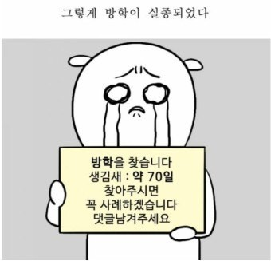
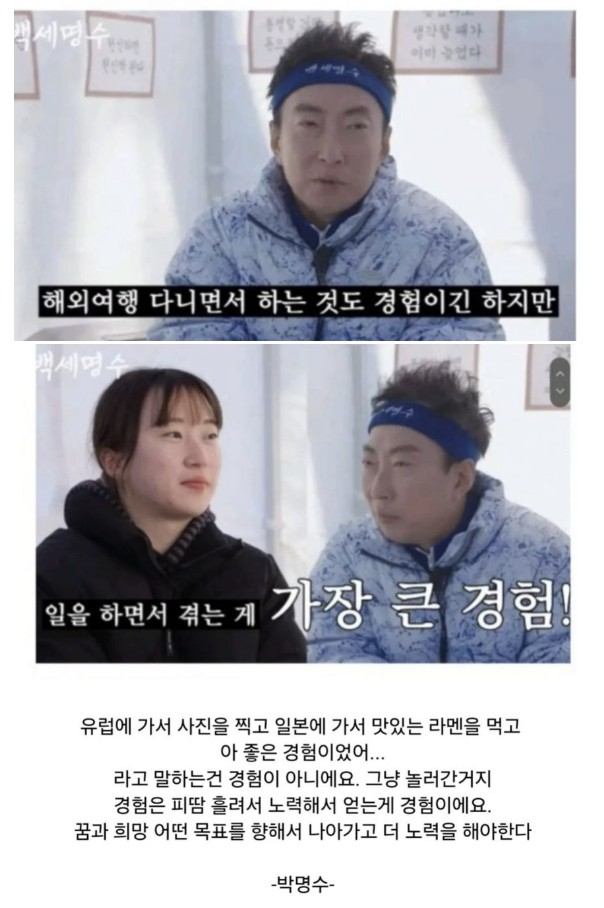
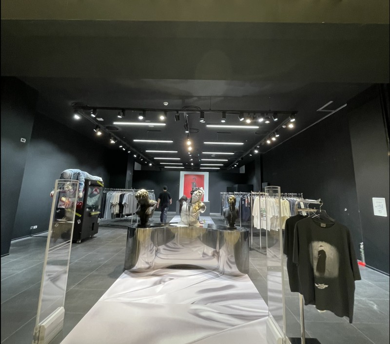
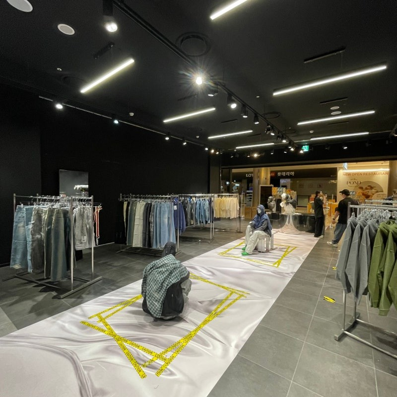
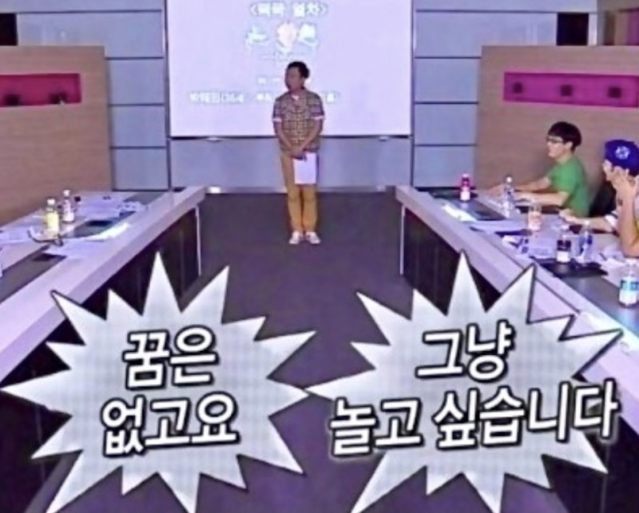
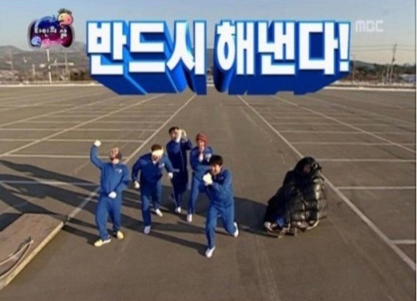
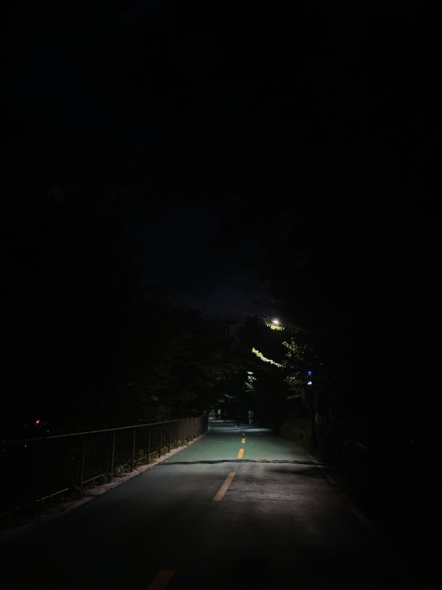

​

2024년 3분기의 마지막 글이다.

​

​

입추를 지나 9월이 다가왔고,

벌써 24년 2학기가 개강했다.

​

(방학 돌려주세요,,,,)

​

전역하고 서울에 자취를 시작한 게 엊그제 같은데

벌써 1학기를 지나 여름방학을 건너 2학기가 다가왔다.

​

​

방학이 지났기 때문에

필자의 방학에 대한 피드백을 해보자면

필자는 방학 때 귀찮더라도 꼭 해야 하는 것을 3가지를 정했었다.

​

첫 번째는 헬스

두 번째는 토익 공부

세 번째는 제3외국어 공부였다.

​

​

첫 번째 헬스는 거의 매일 헬스장에 가서 운동을 했다.

매일 1시간 반에서 2시간을 투자했는데,

헬스는 방학 동안 정말 즐겁게 했다.

​

최근 헬스만으로 근성장의 한계를 느껴

식단까지 해보려고 노력 중이다.

(매일 4~5끼 먹기)

​

​

두 번째는 토익 공부이다.

한 마디로 말해보겠다.

​

​

망. 했. 다

​

​

공부 한 거라고는 토익 영단어 외우는 것 밖에 없었다.

토익은 아마도 계획을 다시 세워 진행해야 될 것 같다.

​

세 번째로 제3외국어 공부,

필자는 제3외국어 공부를 일본어로 해보았다.

​

일본어로 선택한 이유는

일본어가 제일 만만해 보였고,

필자의 군대 선임이 일본에 유학을 하고 있어

일본어에 대한 궁금증이 생겨 혼자 공부하기로 마음먹었었다.

​

​

제3외국어의 목표는 절반 정도 성공했다.

​

매일 공부한 것도 아니었고,

독학으로 공부하는 것이라 한계가 있었지만

​

일본어의 기본과 기초에 대해 익힐 수 있었고,

일본어 회화에 대해 많이 알 수 있었다.

​

​

많은 필자의 또래들이 방학 동안

해외여행을 정말 많이 갔다.

​

​

하지만 필자는 이번 방학 때

해외여행을 한 번도 가지 않았다.

​

​

필자는 방학 동안 한국에 남아 일을 하며 돈을 벌었다.

​

​

그리하여 오늘의 글은 큰 틀의 주제가 있는 것이 아닌

필자가 방학 동안 했던 일, 직장 생활에 대한 이야기와

직장에서 있었던 일들에 대해 말해보려고 한다.

​

---

필자는 연예인 박명수를 좋아한다.

(박명수의 입담과 명언들이 웃기면서 뼈를 때림)

​

1학기가 끝나갈 때 즘

필자의 인스타에 박명수의 짤이 하나 올라왔었다.

​

​

위 사진의 글이었다.

​

정리하자면 여행에서 온 경험보다는

자신이 일을 하면서 피땀 흘려 노력하여 얻은 경험이 값진 경험이다.

라는 내용의 사진이다.

​

​

위 사진은 필자에게 정말 와닿았다.

​

방학 동안 남들처럼 해외여행을 갈까 생각했지만,

직장 생활, 일을 한 번 해보자라고 다짐했다.

​

​

그리하여 필자는 의류 디자인 회사에 취직했다.

​

​

취직하자마자 회사는 다음 팝업스토어로

롯데 잠실 몰에서의 팝업을 준비하고 있었다.

​

​

회사에서 처음으로 하는 규모의 큰 팝업스토어여서

준비할게 정말 많았다.

​

필자의 사수와 필자는 팝업 한 달 전부터

많은 것을 준비했다.

​

팝업 당일

롯데 잠실 몰 특성상 새벽에 준비하여

아침에 열어야 했기 때문에

​

저녁 10시부터 아침 6시까지

팝업을 꾸미고 디자인하며 준비했다.

​

​

필자의 회사에서 디자인한 팝업스토어

팝업스토어 내부

​

옷 박스들이 정말 많아 옮기는데

훈련소 보급 배차하는 느낌이 들었다.

(진짜 일병으로 돌아간 느낌)

​

​

팝업스토어를 관리하면서 많은 사람들을 만났다.

그중 팝업 알바분들이 기억에 남는다.

​

​

팝업 아르바이트하신 분들은 거의

필자의 또래였다.

​

​

필자는 의공학을 전공하고 의공학에

몸을 담그고 있어 다른 학교 다른 학과 분들은

무엇을 준비하고, 미래를 위해 무엇을 노력하는지 궁금했다.

​

​

그리하여 아르바이트하시는 분들에게

미래 무엇을 준비하고 있으신지 많이 여쭤보았다.

​

​

필자는 경악을 금치 못했다.

왜냐면 아르바이트하시는 분들이 정말 다 능력자분들이었기 때문이다.

​

​

어떤 분은 로스쿨을 준비하며, 로펌 인턴을 하고 계셨고,

다른 분은 편입을 하시고 대외 활동을 통해 스펙을 쌓고 계셨다.

​

​

그리고 모든 아르바이트생분들의 공통점이

영어를 정말 원어민처럼 잘하셨다.

​

​

필자는 생각했다.

"저분들이 나와 같은 나이대라고?"

​

꿈은 있지만 꿈을 이루기 위해 노력하지 않은 필자

​

필자는 꿈만 꾸었지,

꿈에 대해 노력하지 않았다는 것을 뼈저리게 느꼈다.

​

만약 제3자가 필자의 꿈에 대해 설명하고

꿈을 이루기 위해 노력 과정에 대해 설명하라고 말한다면

​

필자의 꿈에 대해 설명만 할 수 있지

꿈을 이루기 위해 한 노력들은 설명하지 못하는 것이 현실이었다.

​

사실 필자는 안주하며 살았다.

​

"지금 내 나이대에 이 정도 노력이면

열심히 살고 있는 거지~"

​

이런 안일한 생각을 가지고 살았던 것이다.

​

아르바이트생분들의 꿈과 목표를 듣고

정신을 차릴 수 있었다.

​

그리하여 필자의 꿈을 현실화하기 위한

계획을 체계적으로 새웠다.

​

아르바이트생분들의 꿈과 노력 과정을 듣지 않았더라면

필자는 같은 과 같은 학교 친구들의 꿈만 들으며

우물 안의 개구리처럼 살았을 것이다.

​

​

필자에게 꿈과 노력 과정을 말해준 아르바이트생분들에게

정말 감사하며 꼭 필자에게 말한 꿈을 이루셨으면 좋겠다.

(동갑 친구가 응원합니다.)

​

---

3주라는 시간이 흐르고

어느덧 팝업 마지막 날

​

팝업스토어 해체를 위해

저녁 10시부터 아침 8시까지

​

짐을 나르고 옮기며

필자의 몸이 땀 범벅이 되었다.

​

아침 9시가 돼서야

집에 가는 버스를 탈 수 있었다.

​

신기하게도

집에 가는 버스에는 사람이 아무도 없었다.

​

​

필자는 버스카드를 찍고 들어가는데,

버스 기사님께서 필자에게

"수고하셨습니다."

라는 인사말을 하셨다.

​

필자는 그 말을 듣고 궁금했다.

​

"아침 시간인데 내가 퇴근하시는 걸 어떻게 아시지?"

​

그리하여 실례를 무릅쓰고 필자는 기사님에게 여쭤보았다.

​

"실례지만 기사님 아침 시간인데 제가 퇴근하시는 걸 어떻게 아신 건가요?"

​

버스 기사님께서 말씀하셨다.

​

"얼굴에 뿌듯함이 쓰여있는데요? ㅎㅎ"

​

그렇다.

필자의 몸이 정말 고대고 힘들었지만,

필자도 느끼지 못한 뿌듯함이 남들에게 보였던 것이었다.

​

​

팝업 3주 + 준비 기간 동안

밥도 제시간에 못 먹고,

제대로 쉬지도 못했지만

​

​

​

​

​

​

​

​

필자의 피땀 흘려 얻은 경험은

​

퍼스트 클래스를 타고 가는 해외여행보다

값진 인생 비행기 티켓을 얻었다.

​

​

​

Today Song : Still Fighting It - Ben Folds