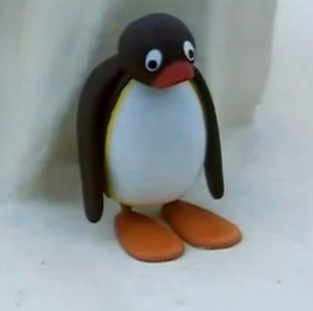
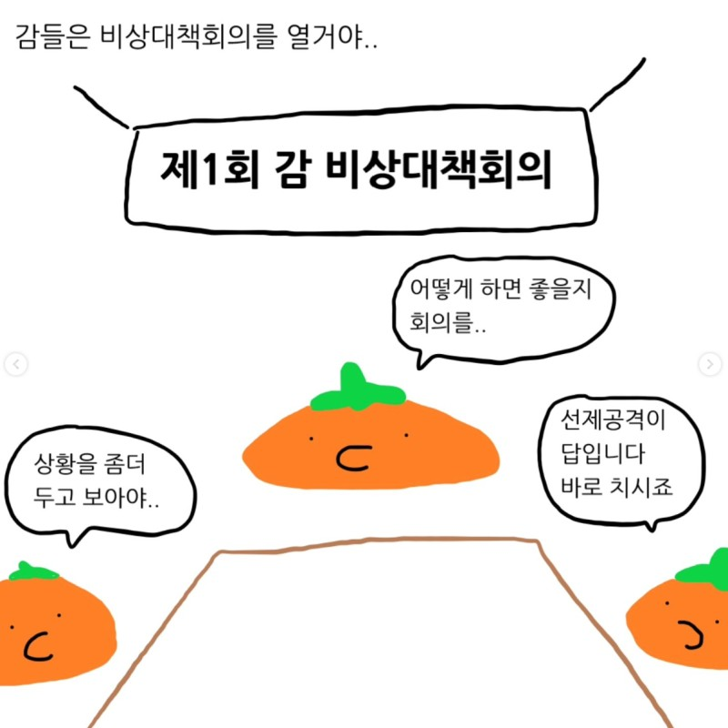
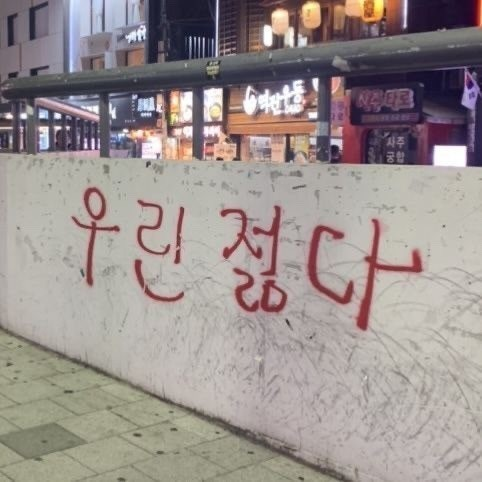
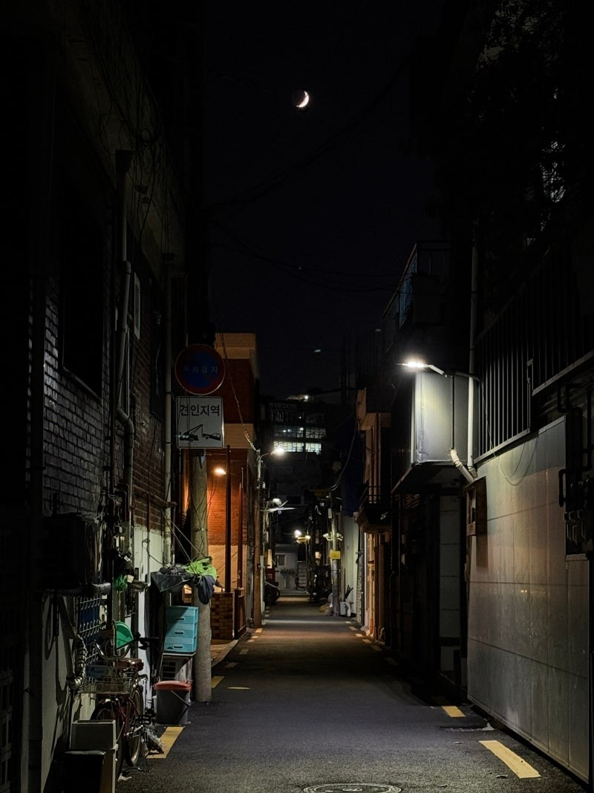

거의 2달 만에 돌아온

필자의 글이다.

​

​

빠른 시일 내에 글을 쓰고 싶었지만,

이놈의 일은 왜 해도 끝이 나질 않는지 모르겠다.

​

필자의 표정

​

글을 안 썼던 필자는

중간고사로 인해 공부에 매진했고,

일에 치여 살았던 것 같다.

​

​

빠른 시일 내에 글을 쓰고 싶었던 필자였지만,

1달 반 동안 쓸만한 필자의 스토리가 없었다.

​

​

생각해 보면 1달 반 동안

뿌듯했고, 행복했던 일이 없었던 것 같다.

​

​

1달 반 동안 집에서

하루 종일 쉬었던 날이 없었다.

​

​

그리하여 필자는

오늘 딱히 약속도 없고 일도 없어서

집에서 하루 종일 쉬면서 많은 생각을 가졌다.

​

​

역시 사람이란 동물은

쉬는 날이 있어야 건강해지는 것 같다.

​

​

그래서 오늘 필자가 말할 주제는

**"여유"이다.**

​

​

---

주제에 들어가기 앞서서

요즘 필자가 정말 재미있게 보는 인스타 만화가 있다.

​

​

<https://www.instagram.com/rmqdid/>

[**급양만와(@rmqdid) • Instagram 사진 및 동영상**

팔로워 196K명, 팔로잉 350명, 게시물 453개 - 급양만와(@rmqdid)님의 Instagram 사진 및 동영상 보기

www.instagram.com](https://www.instagram.com/rmqdid/)

​

바로 급양만와님의 만화이다.

​

​

만화의 주제는

작가가 일상생활을 하면서 상상했던 것에 대해 그린다.

​

​

예를 들어

하나의 에피소드를 말해주자면,

​

​

많은 사람들이

재미없는 이야기를 했을 때,

"감 다 죽었네"

라고 말을 한다.

​

​

그런데 이러한 말을

먹는 감이 듣는다면 어떻게 될까?

라는 상상으로 만화가 시작된다.

출처 : 급양만와

​

어떻게 보면

초등학생이나 어린 친구들이 할만할 상상이지만,

작가는 이러한 상상을 재미있는 요소로 풀어나간다.

​

​

이 작가의 MBIT는 극 N인 것 같다.

​

​

많은 만화를 필자는

정말 재미있게 보았다.

​

​

필자가 만화를 재미있게 보았던 이유는

필자 또한 상상하고, 생각하는 것을

좋아하기 때문이었다.

​

​

그러나 필자는 이 인스타 만화를 보면서

한 가지가 떠올랐다.

​

​

"내가 상상을 안 한 지 정말 오랜 시간이 흘렀구나"

​

​

필자 또한 MBIT에서

N이 90% 이상이 나오는 사람으로

상상하는 것을 정말 좋아하는 사람이다.

​

​

그러나 몇 달 동안 필자가

상상을 했는지 복기해 보았을 때,

필자의 기억으로는 상상을 한 적이 없었다.

​

​

대중교통을 이용할 때

잠에 들기 바빴고,

​

​

집에 도착하면 씻고

침대에 머리가 닿으면

바로 잠에 들기 일쑤였다.

​

​

그렇다면 필자는

왜 상상을 하지 못했을까

​

​

필자의 생각으로는

필자의 인생에 여유가 없어

간단한 상상조차 하지 못한 것이라 생각한다.

​

​

많은 사람들이 필자에게

해준 이야기가 있다.

​

​

"여유를 가져라"

​

​

필자는 군대에서도 그랬고,

사회에 나와서도 여유를 가지라는 말을

정말 많이 들었다.

​

​

필자는 하나에 집중하면

다른 일을 하지 못하는 성격이다.

(멀티를 못함)

​

​

이러한 성격이

필자의 인생에서 여유를 가지지 못하는

큰 요소라고 생각한다.

​

​

그렇다면 여유를 가지기 위해서는

어떠한 방법을 취해야 할까

​

​

필자는 이에 대해

많은 생각을 했다.

​

​

아직까지 확실한 답이

나온 것은 아니지만,

​

​

필자의 인생에서는

"낭비"가 필요하다고 결론지었다.

​

​

필자는 욕심이 많은 사람이라

시간을 허투루 쓰는 것을 정말 싫어했다.

​

​

짬 나는 시간에는

무엇이든지 해야 된다고 생각했다.

​

​

인생은 원래 쓰고 힘든거라는

생각을 가지고 필자는 살았다.

​

​

이러한 생각을 가지고 살았던 필자에게

여유라는 것을 찾지 못한 것은 당연했다.

​

​

여유를 가지기 위해서는

낭비하는 시간이 필요했다.

​

​

​

​

​

낭비를 하게 된다면,

아깝지 않겠냐라고 말하는 사람도 있겠지만

​

​

낭비하는 시간이 있을수록

필자의 인생이 낭만 있어지지 않을까

라는 생각이다.

​

​

낭만에는 낭비가 필수적인 요소인 것이었다.

​

​

필자에게 상대방이

좋아하는 음식이 무엇인지,

좋아하는 영화가 무엇인지,

좋아하는 취미가 무엇인지,

물어보면 필자는 쉽사리 대답하지 못했다.

​

​

이 음식은 이래서 좋고, 저 음식은 저래서 좋고,

필자 자신조차 좋아하는 것이 확실히 무엇인지

갈피를 잡지 못하고 살았었다.

​

​

전에는 이러한 점이 많은 사람들에게

맞춰줄 수 있어 좋다고 생각했지만

​

​

필자가 정말로 좋아하는 것이 무엇이고

무엇을 했을 때 가장 행복한지

알아 가는 것이 필자가 낭비하며 알아야 할 주제이다.

​

​

살아가면서 꼭 쓸모 있는 일만

해야 되는 것은 아니다.

​

​

별 의미 없어 보이고,

쓸모없어 보이더라도

​

​

작은 낭만 하나쯤은

챙길 줄 아는 필자가 되었으면 좋겠다.

​

​

이 글을 읽은 독자들 또한

작은 낭만 하나쯤은

품고 사는 사람이 되기를

​

오늘의 노래 : 지친 하루 - 윤종신