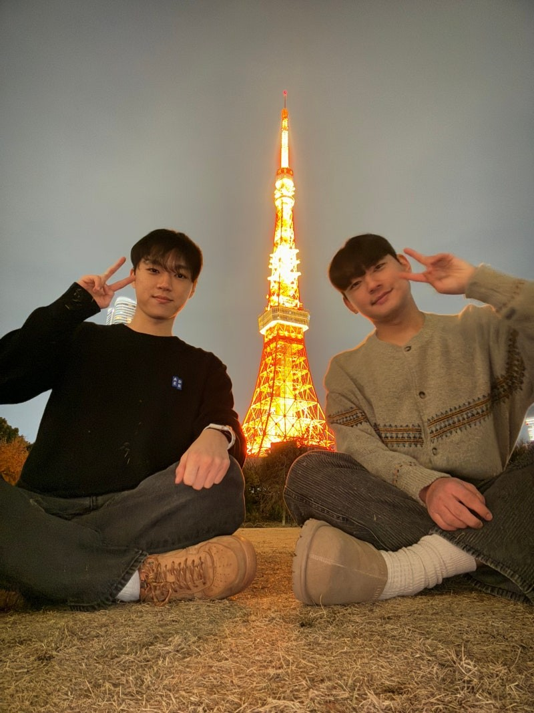
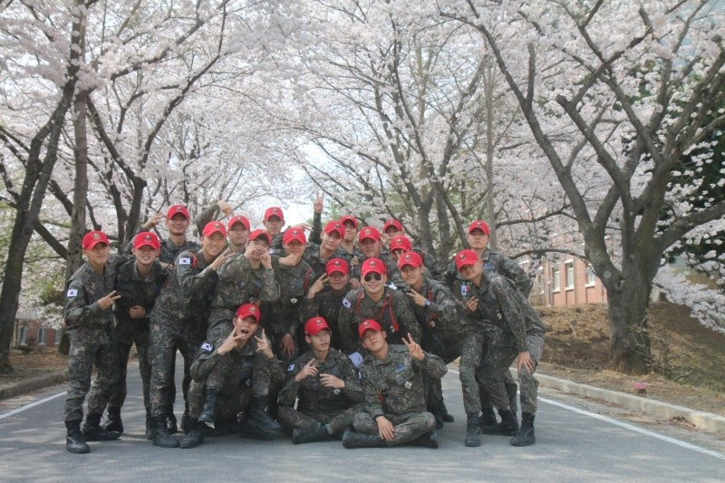
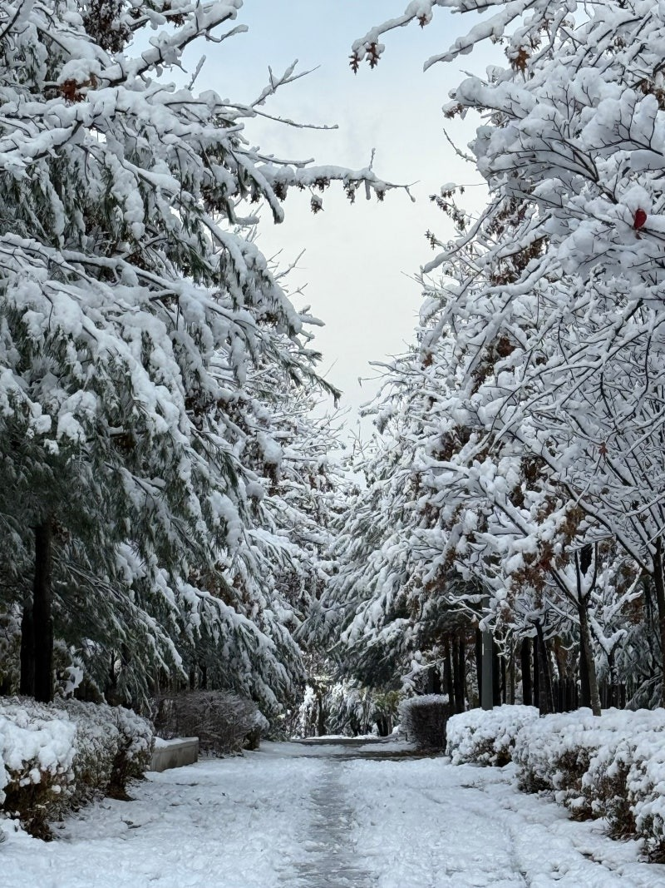

2024년 마지막 글로 돌아온 필자이다.

시간이란 참 빠른 것 같다.

​

​

벌써 2025년이며

필자의 나이가 24살이다.....

2024년 고생 ㅈㄴ많았다.

이글을 읽는 모든이들이

2024년은 행복했던 한해라고 기억했으면 좋겠다.

​

---

​

전역한지 1년이 거의 다가오며,

많은 일들이 2024년에 일어났다.

​

​

2학년 2학기를 끝낸 필자는

연말에 많은 일들을 겪었다.

​

​

가장 큰 이벤트를 말하자면

일본에 갔다온 것이다.

​

​

이때까지는 순조롭게 출발할 줄 알았다.

​

예상치 못하게 형의 여권에 문제가 생겨

계획대로 아침 비행기를 타고 출발하지 못했지만,

​

​

일본여행은 필자에게 많은

새로운 경험을 주었다.

​

​

첫 번째로 새로운 경험은

외국인들의 일본에 대한 이미지이다.

​

​

필자는 일본에 가기 전에는

한국과 일본의 국제적인 위상은

비슷한 선상에 있다고 생각했다.

​

​

그러나 이 생각은 일본의 식당과

편의점을 가고 산산조각났다.

​

​

필자가 일본에 있는 5일동안

많은 편의점과 식당을 갔다.

​

​

그곳에는 공통점이 있었는데,

모두 워킹홀리데이로 일본에 온 외국인 분들이

식당 서빙 및 편의점 캐셔업무를 하고 계셨다.

​

​

한국을 비교했을 때, 식당과 편의점에서

백인 외국인들이 워홀로 한국에 와서 일하는

모습을 본적이 있는가?

​

​

필자는 본적이 없다.

또한 한국은 외국인 노동자의 비율이

동남아 쪽이 월등하게 높다.

​

​

그러나 일본은 영어권 외국인들의

워홀비중이 정말 높았다.

​

​

이를 토대로 필자가 생각해 본다면,

아직까지는 외국인들이 생각했을 때,

​

​

한국보다는 일본을 더 선호하는

나라라고 생각할 수 있는 경험이었다.

​

​

두 번째 새로운 경험은

아무리 사람이 많은 곳이어도

길거리에서 담배를 피는 사람이 1명도 없었다.

​

​

필자는 도쿄의 붐비는 곳을 많이 돌아다녔다.

​

​

그 중 숙소를 신주쿠쪽으로 잡고 돌아다녔는데,

신주쿠역의 출구의 갯수는 130여개였다....

​

처음에 듣고 거짓말인 줄 알았다.

(사람이 많다고하는 강남역도 출구가 20개는 안되는데..)

​

​

알고 보니 일본의 출구는 사람이 붐비는 것을 대비하여

각 출구를 여러개로 나누어둔 것이였고,

서로 마주보고 있는 출구도 정말 많았다.

(강남역 1-1번 1-2번 1-3번 출구 이런느낌)

​

​

한국은 한 교차로의 한 방향에

하나의 출구만 있지만

일본은 한 교차로의 한 방향에 출구가 3개이상이 있는 것이다.

(이 많은 출구도 사람이 가득 찼었다.)

​

​

놀랍게도 길빵을 하는 사람이 적다.

(여행하면서 거의 못 봄)

​

​

길거리에 흡연부스가 존재하는데,

그 흡연부스조차 사용 인원이 제한되어 있어,

흡연부스 앞에서 줄 서서 자신의 순서를 기다린 후

흡연을 하는 사람이 정말 많았다.

(흡연자들은 일본에서 좀 힘들 듯)

​

​

필자는 비흡연자라 흡연자의 마음을

잘 이해하지는 못하지만

​

​

비흡연자의 입장으로는

길거리 흡연이 없는 것은 정말 신기했다.

​

​

이렇게 글을 보면 필자가 일뽕에 가득 차서

글을 쓰는 것 같지만

​

​

누가 뭐라 해도 필자는 한국이 좋다.

여행하면서 신기한 경험이 많았지만,

​

​

한국이 좋은 점도 정말 많다.

​

​

필자가 처음으로 돈을 벌고

남의 도움 없이 처음부터 끝까지 자력으로 다녀온

해외여행이었다.

​

​

서울도 배울 점이 많고

큰 도시라 생각했는데,

​

​

비행기를 2시간만 타고 가면

더 큰 세계가 있었고,

​

​

도쿄를 구경하고 경험하며

많은 생각을 할 수 있는 소중한 시간이었다.

​

​

---

그리고 연말 마지막으로

군대 사람들과 여행을 갔다.

​

​

여기서 군대 사람들이라고 하면,

필자와 함께 조교 생활을 한

신병제2훈련대대 조교들이다.

​

​

같이 근무했던 모든 이들을 만나지는 못했지만

그리운 얼굴들을 많이 만났다.

바른걸음 똑바로 해라

​

사실 필자가 블로그에서

군대 이야기를 잘 안 하는 이유는

​

​

군 시절 이야기를 한 번 시작하면

끝나지 않기 때문이다.

(풀 썰이 정말 많다.)

​

​

그렇다면 군대사람들과

모이면 무슨 이야기를 할까?

​

​

​

저 짠을 시작으로

술 마시면서 처음부터 끝까지 군대 이야기만 했다...

​

​

필자는 남들과는 다른 보직으로 군 생활을 했다.

사회에 나와서 군 생활에 대해 이야기하면,

남들은 왜 이렇게 뺑이만 쳤냐고 이해 못 하지만

​

​

필자와 군 생활을 같이 한 조교들과

군대 이야기를 하면 서로를 너무 잘 이해하며,

이야기를 할수록 여러 썰들과 썰들의 비하인드가 나온다.

​

​

필자의 인간관계에서

만나면 웃음이 끊이지 않는 소중한 사람들이다.

​

​

2024년 3월에 전역을 하며

부대 정문을 나오면서 다짐한 것이 한 가지가 존재한다.

​

​

한 가지 다짐한 것이 2024년 필자의 목표였다.

​

​

한 가지 다짐은 군대에서의 배움을 잃지 않는 것이었다.

​

​

필자가 근무한 부대는 야생 그 자체였다.

​

​

약한 모습을 보이면 더 헐뜯으려 하는 사람들이 많은 집단이었다.

(사실 짬찌일때 선임들이 잡기 위해서 그랬던 거 같음)

​

​

그도 그럴 것이 사회에서 운동과 신체를 쓰는 직업을 가진

사람들이 선임 조교로 많았으며,

​

​

경상도 사투리로 표현하자면,

씩한 사람들만 있는 야생이었다.

(씩하다 = 남자답다? 이런 느낌)

​

​

사실 필자는 군대를 가기 전까지

독기와 씩함이란 1도 찾아볼 수 없는 사람이었다.

​

​

처음 전입을 왔을 때,

적응하기 많이 버거웠다.

​

​

그러나 포기할 수 있었지만

정말 포기하기 싫었다.

​

​

애초에 조교에 지원할 때도

"내가 제일 잘할 수 있겠는데?"

라는 생각을 가지고 지원했기 때문이다.

​

​

그리하여 여기서 내가 제일 잘해야겠다.

라는 생각으로 독기를 품고 군 생활에 임했다.

​

​

독기를 가지고 임하다 보니

한 명씩 필자에 대해 인정해 주기 시작했고,

​

​

어쩌다 보니

필자가 남에게 인정을 해 줄 수 있는 자리까지 올라갈 수 있었다.

​

(좌) 새 군화 / (우) 조교 시절 필자가 신은 군화

​

그리하여 필자는 군대 생활에서

마음만 먹으면 안 되는 일은 없다고 고통을 참아가며

뼈저리게 느꼈다.

​

​

이 생각이 필자가 군대 생활을 하며

배운 가장 값진 경험이고,

사회에 나와서도 이 배움은 절대 잊고 싶지 않았다.

​

​

Winning Mentality(위닝 멘탈리티)

"어떠한 상황에서도 이길 수 있는 자신감과 믿음"

​

​

요즘 필자의 주변 사람들을 보면

위닝 멘탈리티가 부족한 사람들이 정말 많다.

​

​

그 사람들의 말을 들어보면

성공해 본 경험이 없어, 실패했을 때 돌아오는 파장이

무섭다고 말한다.

​

​

주변 사람들의 말을 들은 필자는

고민에 빠졌다.

​

​

"그렇다면 나는 큰 성공을 해본 적도 없는데,

무슨 자신감으로 살아가는 걸까?"

​

​

생각해 보니 답을 찾았다.

​

​

군대에서 겪은 필자의 고통이

사회에서의 위닝 멘탈리티의 뼈대가 된 것이라고,

​

​

작은 사회에서 2년 동안 있으면서

수많은 일을 겪으며 실패도 해보고 성공도 해보았기 때문에

남들보다 실패에 대한 고통의 역치가 낮은 것이라고,

​

---

2024년은 정말 순식간에 지나간 한 해였다.

여름을 준비하면 가을이 다가왔고,

​

​

가을을 준비하면 겨울이 성큼 다가온 한 해였다.

​

​

그렇지만 생각해 본다면

2024년에 다짐한 것들을 하루도 빠짐없이

생각하고 고민했던 것 같다.

​

​

2025년의 목표와 다짐은

아직까지 세부적으로 잡지 못하였지만,

​

​

2024년보다는 1년 더 성숙한 모습으로

2025년을 보내고 싶은 필자의 바람이다.

​

이 글을 읽는 분들에게

2024년 한 해 고생 많았고,

​

​

2025년에는 아프더라도 조금만 아프고,

2024년보다 조금 더 행복한 한 해가 되길 바란다.

​

​

​

​

​

​

Today Song : We Are Young - Fun