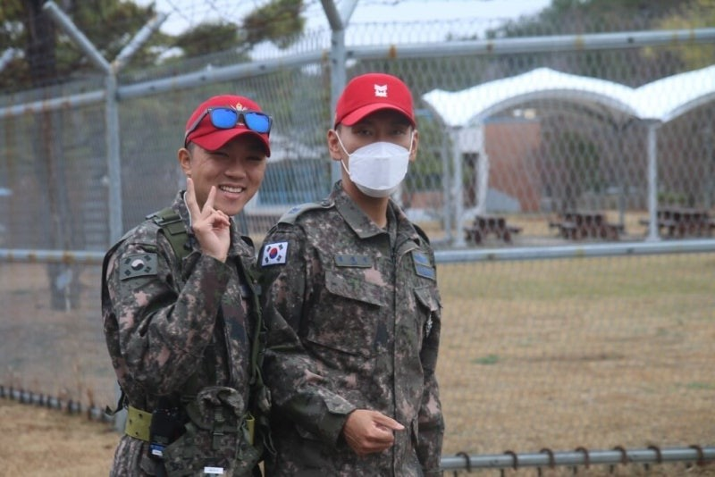

겨울잠을 깨고 돌아온 필자이다.

​

​

사실 겨울방학이라는 잠에서 깨어 개강이라는 현실을 맞이한 필자이다.

​

​

이번 겨울은 유난히도 눈이 많이 내리고 쌓인 것 같다.

​

​

군대에 있을 때 보다 눈을 더 많이 보았다.

​

​

첫눈이 내렸을 때는 필자의 낭만을 채워주었지만,

세 번째부터 내린 눈은 그다지 필자의 눈에 들어오지 않았다.

(길이 다 얼어서 다니기 힘들었다;;)

​

대중교통을 타기 위해 기다리는 필자

이번 겨울은 유난히도 더 춥게 느껴진 필자였다.

---

​

필자의 이번 방학은

기억에 남는 에피소드 없이 지나갔다.

​

​

필자의 방학 프리뷰를 빠르게 쓰고 싶었지만,

딱히 기억나는 일과 에피소드가 없어 글을 쓰기까지

오랜 시간이 걸렸던 거 같다.

​

(무슨 글을 쓸지 고민에 빠진 필자)

​

​

---

​

필자의 이번 방학의 주제는

"그냥 한다"였다.

​

​

필자는 생각이 정말 많은 사람이다.

무엇을 하나 하더라도 이렇게 해볼까

저렇게 해볼까라는 생각을 정말 많이 한다.

​

​

생각이 많은 것은 신중하다는 장점도 있지만,

기회를 잡을 수 있을 때,

놓칠 수 있다는 큰 단점이 존재한다.

​

​

그리하여 이번 방학은

"해야 할 것"과 " 하고 싶은 것"을

극명하게 나눠 구분하고 계획을 세웠다.

​

​

방학 1달 반 동안 큰 생각 없이,

계획대로 살았다.

​

​

좋았던 점은

필자가 침대에서 일어나고 잘 때까지

"이걸 하는 게 맞나?"라는 의구심이 들지 않았다.

​

정말 말 그대로

계획대로 그냥 했기 때문이다.

​

​

단점으로는

필자 혼자 하는 일이 많아져

말을 한 마디도 하지 않고 넘어가는 날이 있었다.

​

당시에는 느끼지 못했다.

며칠이 지나고 필자가 자기 전에 누워서 생각해 보니,

"말을 정말 안 했구나"라고 생각이 들었다.

​

​

외로움이라는 감정은 당시에는 무디지만

하루를 돌아봤을 때, 생각나는 감정인 것 같다.

(그렇다고 해서 외로워서 우울하거나 이런 건 또 아님)

​

외로운 상황을 쿨하게 넘어가는 필자

​

​

간단하게 말하면 이번 필자의 방학은 필자의 다짐대로

"그냥 했고, 그냥 넘어갔다."

​

---

- Episod

​

2월에 필자는 군 생활 중

쫓겨나듯 나갔던 진주를 다녀왔다.

​

​

계획에 없던 일로 진주로 향하였다.

​

​

필자가 기억하는 진주와 크게 달라진 것이

하나도 없었다.

​

---

임중사님 : "야 민짜이 이 노래 제목이 뭐고?" (릴스를 보여주며)

​

필자 : "흐음 .... 한번 알아보겠습니다"

"요즘 릴스에 많이 나오던데, 아마도 ooo 이게 제목일 겁니다."

​

임중사님 : "야 이 노래 좋더라~"

"야 여기서 농땡이 피우지 말고 끄지라 빨리~!"

---

​

그때부터 임중사님의 컬러링과 벨소리는 ooo이었다.

​

​

교육상황실 당직을 설 때마다 컨텍을 하기 위해

임중사님에게 전화를 걸면 ooo이 들렸다.

(수화기 너머로 들리는 ooo은 듣기 좋았다.)

​

​

사회에 나와서도 ooo이 들리면

임중사님 생각이 났다.

​

​

임중사님은 유함과 빡셈이 공존하는 사람이었다.

비유하자면 츤데레같은 사람이었다.

​

​

군대에서 필자가 많은 것을 보고 배운 사람 중 한 분이다.

​

​

스포츠를 정말 좋아하셨고,

러닝과 사이클을 타시는 걸 정말 좋아하셨다.

​

​

아마도 오랜 시간이 지나도

ooo이 들리면

임중사님 생각은 계속 날 것 같다.

​

​

다시 보지 못한다는 것은

필자가 여러 조사를 통해 간접적으로 느껴보아도

무뎌지지 않는 것 같다.

​

​

​

"임중사님 인생의 한순간 한 장면에 같이 있을 수 있어 즐거웠고, 행복했습니다."

​

​

​

​

ooo

오늘의 노래 : Nicky Youre & dazy - Sunroof